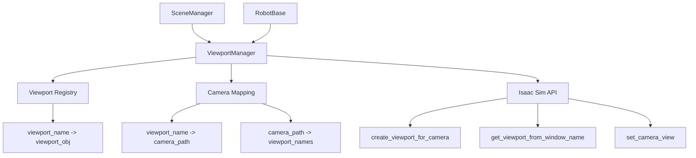

# Design Document

## Overview

设计一个简洁高效的ViewportManager类，专门负责管理Isaac Sim中的viewport和camera映射关系。该设计遵循单一职责原则，从scene_manager中独立出来，提供清晰的API接口，最小化异常处理的使用。核心功能包括viewport实例记录、精确的viewport切换、camera映射管理以及批量robot viewport操作。

## Architecture

### 核心设计原则

1. **单类设计**: 仅使用一个ViewportManager类，包含所有相关功能
2. **最小异常处理**: 优先使用条件判断，仅在与外部API交互时使用try-except
3. **单一职责**: 专注于viewport管理，不处理其他业务逻辑
4. **性能优化**: 使用字典映射实现O(1)查找性能
5. **精确控制**: 支持指定viewport名称和camera路径的精确切换
6. **自动管理**: 自动记录viewport实例化信息和清理机制
7. **方法简洁**: 每个方法不超过30行，保持代码可读性

### 系统架构图



## Components and Interfaces

### 1. ViewportManager 核心类

```python
class ViewportManager:
    def __init__(self):
        self._viewports: Dict[str, Any] = {}  # viewport注册表 (name -> viewport_obj)
        self._mappings: Dict[str, str] = {}   # viewport->camera映射 (viewport_name -> camera_path)
        self._reverse_mappings: Dict[str, List[str]] = {}  # camera->viewports反向映射 (camera_path -> viewport_names)
        self._viewport_sources: Dict[str, str] = {}  # viewport来源记录 (viewport_name -> source_type)
```

**设计决策**: 添加viewport来源记录以支持批量robot管理和清理操作，便于区分手动创建和自动创建的viewport。

#### 核心方法设计

**1.1 Viewport注册管理**
- `register_viewport(name: str, viewport_obj: Any) -> bool`
- `unregister_viewport(name: str) -> bool`
- `get_viewport(name: str) -> Optional[Any]`
- `list_viewports() -> List[str]`

**1.2 Camera映射管理**
- `map_camera(viewport_name: str, camera_path: str) -> bool`
- `unmap_camera(viewport_name: str) -> bool`
- `get_camera_path(viewport_name: str) -> Optional[str]`

**1.3 Viewport切换功能**
- `change_viewport(camera_prim_path: str, viewport_name: str = None) -> bool`

**设计决策**: 简化返回值，change_viewport直接返回bool表示成功或失败，减少复杂性。

**1.4 批量操作**
- `register_robot_viewports(robots: List[Any]) -> int` (返回成功注册的数量)

### 2. ViewportManager 内部方法设计

**2.1 基础验证方法**
- `_is_valid_camera_path(camera_path: str) -> bool` (仅检查非空字符串)

**2.2 Isaac Sim API 封装方法**
- `_get_active_viewport() -> Optional[Any]`
- `_set_viewport_camera(viewport: Any, camera_path: str) -> bool`

**设计决策**: 简化API封装，只保留最核心的方法，减少不必要的抽象层。

## Data Models

### ViewportInfo 数据结构

```python
@dataclass
class ViewportInfo:
    name: str
    viewport_obj: Any
    camera_path: Optional[str] = None
    is_active: bool = False
    source: str = "manual"  # "manual", "robot", "official"
    created_at: Optional[str] = None
```

**设计决策**: 移除复杂的数据结构，使用简单的返回值类型（bool, int, Optional等），减少代码复杂度和维护成本。

## Error Handling

### 错误处理策略

1. **最小验证**: 仅检查关键参数（如非空字符串）
2. **条件判断优先**: 使用if-else替代try-except处理可预期的情况
3. **最小异常范围**: 仅在与Isaac Sim API交互时使用try-except
4. **简单返回值**: 使用bool或基础类型表示操作结果
5. **静默失败**: 操作失败时返回False，不抛出异常

**设计决策**: 采用"简单可靠"策略，减少过度的安全检查，专注于核心功能实现。

### 错误分类

**设计决策**: 移除错误常量定义，简化错误处理，直接使用返回值表示成功或失败状态。

## Testing Strategy

### 功能验证策略

1. **手动验证流程**
   - 通过实际的Isaac Sim环境验证viewport注册和切换功能
   - 验证与SceneManager和RobotBase的集成效果
   - 确认批量操作的正确性和性能表现

2. **代码审查重点**
   - 确保每个方法符合30行限制
   - 验证异常处理仅在API交互层使用
   - 检查字典映射的一致性维护

3. **实际场景测试**
   - 多robot环境下的viewport管理
   - 频繁切换场景下的性能表现
   - 错误恢复和清理机制验证

## Implementation Details

### 核心实现策略

1. **字典映射优化**: 使用Python字典实现O(1)查找性能
2. **懒加载**: viewport对象按需获取，避免不必要的API调用
3. **缓存机制**: 缓存Isaac Sim API调用结果，减少重复查询
4. **批量操作优化**: 使用列表推导和批量API调用提高性能

### 代码结构

```
viewport_manager_enhanced.py
├── ViewportManager (唯一主类)
│   ├── 公共方法 (viewport注册、映射、切换、批量操作)
│   ├── 私有API封装方法 (_get_active_viewport, _set_viewport_camera)
│   └── 私有验证方法 (_is_valid_camera_path)
└── 便捷函数 (全局访问接口)
```

**设计决策**: 极简化设计，只保留最核心的功能和最必要的验证，减少代码复杂度。

### 与现有代码的集成

1. **SceneManager改造**
   - 移除viewport相关方法实现
   - 添加ViewportManager实例
   - 委托调用viewport操作

2. **RobotBase改造**
   - 简化viewport创建逻辑
   - 使用ViewportManager注册viewport
   - 移除重复的viewport管理代码

### 性能考虑

1. **内存优化**: 使用弱引用避免循环引用
2. **查询优化**: 预建立反向映射索引
3. **批量优化**: 减少单次API调用，使用批量操作
4. **缓存策略**: 缓存频繁查询的viewport对象

## Migration Plan

### 阶段1: 创建新的ViewportManager
- 实现核心ViewportManager类
- 添加基础的注册和映射功能
- 编写单元测试

### 阶段2: 重构SceneManager
- 移除viewport相关代码
- 集成ViewportManager
- 保持API兼容性

### 阶段3: 重构RobotBase
- 简化viewport创建逻辑
- 使用新的ViewportManager API
- 测试第三人称相机功能

### 阶段4: 优化和清理
- 性能优化
- 代码清理
- 文档更新