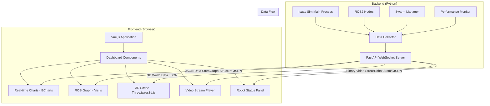

# Design Document

## Overview

The WebManager is a modern web-based monitoring and control interface for Isaac Sim that provides real-time visualization and interaction capabilities. The system follows a data-driven architecture where the backend streams structured JSON data via WebSocket connections, and the frontend performs all rendering using modern browser capabilities. This approach eliminates the need for server-side image generation and provides superior performance and interactivity.

## Architecture

### System Architecture



### Technology Stack

- **Backend Framework**: FastAPI with WebSocket support
- **Real-time Communication**: WebSocket for bidirectional data streaming
- **Frontend Framework**: Vue.js 3 with Composition API
- **3D Visualization**: Three.js + ros3d.js for ROS-compatible 3D rendering
- **2D Charts**: Apache ECharts for interactive data visualization
- **Network Graphs**: Vis.js for ROS computation graph display
- **Styling**: CSS Grid and Flexbox for responsive layout

## Components and Interfaces

### Backend Components

#### 1. WebSocket Server (web_server.py)

```python
from fastapi import FastAPI, WebSocket
from fastapi.staticfiles import StaticFiles
from fastapi.responses import HTMLResponse
import asyncio
import json
import threading
from typing import Dict, List, Any
import time

class WebSocketManager:
    def __init__(self):
        self.active_connections: List[WebSocket] = []
        self.data_store: Dict[str, Any] = {}
    
    async def connect(self, websocket: WebSocket):
        await websocket.accept()
        self.active_connections.append(websocket)
        await self.send_initial_data(websocket)
    
    def disconnect(self, websocket: WebSocket):
        self.active_connections.remove(websocket)
    
    async def send_initial_data(self, websocket: WebSocket):
        await websocket.send_text(json.dumps({
            "type": "initial_data",
            "data": self.data_store
        }))
    
    async def broadcast_update(self, data_type: str, data: Any):
        message = json.dumps({
            "type": "data_update",
            "data_type": data_type,
            "data": data,
            "timestamp": time.time()
        })
        
        disconnected = []
        for connection in self.active_connections:
            await connection.send_text(message)
    
    async def send_binary_data(self, data_type: str, binary_data: bytes):
        message_header = json.dumps({
            "type": "binary_data",
            "data_type": data_type,
            "size": len(binary_data)
        }).encode() + b'\n'
        
        for connection in self.active_connections:
            await connection.send_bytes(message_header + binary_data)

class WebUIServer:
    def __init__(self, host: str = "0.0.0.0", port: int = 8080):
        self.app = FastAPI()
        self.host = host
        self.port = port
        self.websocket_manager = WebSocketManager()
        self.setup_routes()
    
    def setup_routes(self):
        self.app.mount("/static", StaticFiles(directory="UI/static"), name="static")
        
        @self.app.get("/")
        async def get_dashboard():
            with open("UI/templates/dashboard.html") as f:
                return HTMLResponse(content=f.read())
        
        @self.app.websocket("/ws")
        async def websocket_endpoint(websocket: WebSocket):
            await self.websocket_manager.connect(websocket)
            while True:
                data = await websocket.receive_text()
                message = json.loads(data)
                await self.handle_websocket_message(websocket, message)
    
    async def handle_websocket_message(self, websocket: WebSocket, message: Dict):
        message_type = message.get("type")
        
        if message_type == "request_chart_update":
            chart_type = message.get("chart_type")
            await self.generate_chart_data(chart_type)
        elif message_type == "camera_control":
            await self.handle_camera_control(message.get("action"))
    
    async def generate_chart_data(self, chart_type: str):
        # Generate chart data based on type
        pass
    
    def start_server(self):
        import uvicorn
        uvicorn.run(self.app, host=self.host, port=self.port)
    
    async def update_robot_positions(self, positions: Dict[str, Dict]):
        await self.websocket_manager.broadcast_update("robot_positions", positions)
    
    async def update_performance_metrics(self, metrics: Dict[str, float]):
        await self.websocket_manager.broadcast_update("performance_metrics", metrics)
    
    async def update_ros_graph(self, graph_data: Dict):
        await self.websocket_manager.broadcast_update("ros_graph", graph_data)
    
    async def send_camera_frame(self, frame_data: bytes):
        await self.websocket_manager.send_binary_data("camera_frame", frame_data)
```

#### 2. Data Collector (data_collector.py)

```python
import asyncio
import threading
import time
from collections import deque
from typing import Dict, Any, List
import numpy as np
import cv2

class DataCollector:
    def __init__(self, web_server: WebUIServer, max_history: int = 1000):
        self.web_server = web_server
        self.max_history = max_history
        self.robot_data_history = deque(maxlen=max_history)
        self.performance_history = deque(maxlen=max_history)
        self.collecting = False
        self.collection_task = None
    
    def start_collection(self):
        self.collecting = True
        self.collection_task = asyncio.create_task(self._collection_loop())
    
    def stop_collection(self):
        self.collecting = False
        if self.collection_task:
            self.collection_task.cancel()
    
    async def _collection_loop(self):
        while self.collecting:
            await self._collect_robot_data()
            await self._collect_performance_data()
            await self._collect_ros_data()
            await self._collect_camera_data()
            await asyncio.sleep(0.1)  # 10Hz update rate
    
    async def _collect_robot_data(self):
        # Collect robot position and status data
        robot_positions = self._get_robot_positions()
        self.robot_data_history.append({
            'timestamp': time.time(),
            'positions': robot_positions
        })
        await self.web_server.update_robot_positions(robot_positions)
    
    async def _collect_performance_data(self):
        # Collect system performance metrics
        metrics = {
            'fps': self._get_simulation_fps(),
            'cpu_usage': self._get_cpu_usage(),
            'memory_usage': self._get_memory_usage(),
            'ros_message_rate': self._get_ros_message_rate()
        }
        self.performance_history.append({
            'timestamp': time.time(),
            'metrics': metrics
        })
        await self.web_server.update_performance_metrics(metrics)
    
    async def _collect_ros_data(self):
        # Collect ROS graph information
        ros_graph = self._get_ros_graph_data()
        await self.web_server.update_ros_graph(ros_graph)
    
    async def _collect_camera_data(self):
        # Collect and stream camera frames
        frame = self._get_camera_frame()
        if frame is not None:
            _, encoded_frame = cv2.imencode('.jpg', frame, [cv2.IMWRITE_JPEG_QUALITY, 80])
            await self.web_server.send_camera_frame(encoded_frame.tobytes())
    
    def _get_robot_positions(self) -> Dict[str, Dict]:
        # Interface with swarm manager to get robot positions
        return {}
    
    def _get_simulation_fps(self) -> float:
        # Get Isaac Sim FPS
        return 60.0
    
    def _get_cpu_usage(self) -> float:
        # Get system CPU usage
        return 45.0
    
    def _get_memory_usage(self) -> float:
        # Get system memory usage
        return 60.0
    
    def _get_ros_message_rate(self) -> float:
        # Get ROS message publishing rate
        return 30.0
    
    def _get_ros_graph_data(self) -> Dict:
        # Get ROS nodes and topics information
        return {
            'nodes': [],
            'topics': [],
            'connections': []
        }
    
    def _get_camera_frame(self) -> np.ndarray:
        # Get camera frame from Isaac Sim
        return None
    
    def generate_chart_data(self, chart_type: str) -> Dict:
        if chart_type == "robot_trajectories":
            return self._generate_trajectory_data()
        elif chart_type == "performance_trends":
            return self._generate_performance_trends()
        return {}
    
    def _generate_trajectory_data(self) -> Dict:
        # Generate trajectory chart data from history
        trajectories = {}
        for entry in list(self.robot_data_history):
            timestamp = entry['timestamp']
            for robot_id, position in entry['positions'].items():
                if robot_id not in trajectories:
                    trajectories[robot_id] = {'x': [], 'y': [], 'timestamps': []}
                trajectories[robot_id]['x'].append(position.get('x', 0))
                trajectories[robot_id]['y'].append(position.get('y', 0))
                trajectories[robot_id]['timestamps'].append(timestamp)
        
        return {
            'chart_type': 'line',
            'series': [
                {
                    'name': robot_id,
                    'data': list(zip(traj['x'], traj['y'])),
                    'type': 'line'
                }
                for robot_id, traj in trajectories.items()
            ]
        }
    
    def _generate_performance_trends(self) -> Dict:
        # Generate performance trend chart data
        timestamps = []
        fps_data = []
        cpu_data = []
        memory_data = []
        
        for entry in list(self.performance_history):
            timestamps.append(entry['timestamp'])
            metrics = entry['metrics']
            fps_data.append(metrics.get('fps', 0))
            cpu_data.append(metrics.get('cpu_usage', 0))
            memory_data.append(metrics.get('memory_usage', 0))
        
        return {
            'chart_type': 'line',
            'xAxis': timestamps,
            'series': [
                {'name': 'FPS', 'data': fps_data, 'type': 'line'},
                {'name': 'CPU Usage %', 'data': cpu_data, 'type': 'line'},
                {'name': 'Memory Usage %', 'data': memory_data, 'type': 'line'}
            ]
        }
```

### Frontend Components

#### 1. Main Dashboard (dashboard.html)

```html
<!DOCTYPE html>
<html lang="en">
<head>
    <meta charset="UTF-8">
    <meta name="viewport" content="width=device-width, initial-scale=1.0">
    <title>Isaac Sim WebManager</title>
    <script src="https://unpkg.com/vue@3/dist/vue.global.js"></script>
    <script src="https://cdn.jsdelivr.net/npm/echarts@5.4.0/dist/echarts.min.js"></script>
    <script src="https://unpkg.com/vis-network/standalone/umd/vis-network.min.js"></script>
    <script src="https://cdnjs.cloudflare.com/ajax/libs/three.js/r128/three.min.js"></script>
    <link rel="stylesheet" href="/static/css/dashboard.css">
</head>
<body>
    <div id="app">
        <header class="dashboard-header">
            <h1>Isaac Sim WebManager</h1>
            <div class="connection-status" :class="connectionStatus">
                {{ connectionStatus === 'connected' ? 'Connected' : 'Disconnected' }}
            </div>
        </header>
        
        <main class="dashboard-grid">
            <robot-status-panel 
                :robots="robotData" 
                class="panel robot-panel">
            </robot-status-panel>
            
            <performance-panel 
                :metrics="performanceMetrics" 
                class="panel performance-panel">
            </performance-panel>
            
            <chart-panel 
                :chart-data="chartData" 
                chart-id="trajectory-chart"
                title="Robot Trajectories"
                class="panel chart-panel">
            </chart-panel>
            
            <chart-panel 
                :chart-data="performanceChartData" 
                chart-id="performance-chart"
                title="Performance Trends"
                class="panel chart-panel">
            </chart-panel>
            
            <ros-graph-panel 
                :graph-data="rosGraphData" 
                class="panel ros-panel">
            </ros-graph-panel>
            
            <camera-panel 
                :stream-url="cameraStreamUrl" 
                class="panel camera-panel">
            </camera-panel>
        </main>
    </div>

    <script src="/static/js/components/robot-status-panel.js"></script>
    <script src="/static/js/components/performance-panel.js"></script>
    <script src="/static/js/components/chart-panel.js"></script>
    <script src="/static/js/components/ros-graph-panel.js"></script>
    <script src="/static/js/components/camera-panel.js"></script>
    <script src="/static/js/dashboard.js"></script>
</body>
</html>
```

#### 2. Vue.js Application (dashboard.js)

```javascript
const { createApp, ref, onMounted, onUnmounted } = Vue;

const DashboardApp = {
    setup() {
        const connectionStatus = ref('disconnected');
        const robotData = ref({});
        const performanceMetrics = ref({});
        const chartData = ref({});
        const performanceChartData = ref({});
        const rosGraphData = ref({});
        const cameraStreamUrl = ref('');
        
        let websocket = null;
        
        const connectWebSocket = () => {
            const protocol = window.location.protocol === 'https:' ? 'wss:' : 'ws:';
            const wsUrl = `${protocol}//${window.location.host}/ws`;
            
            websocket = new WebSocket(wsUrl);
            
            websocket.onopen = () => {
                connectionStatus.value = 'connected';
                console.log('WebSocket connected');
            };
            
            websocket.onclose = () => {
                connectionStatus.value = 'disconnected';
                console.log('WebSocket disconnected');
                // Attempt reconnection after 3 seconds
                setTimeout(connectWebSocket, 3000);
            };
            
            websocket.onmessage = (event) => {
                const message = JSON.parse(event.data);
                handleWebSocketMessage(message);
            };
            
            websocket.onerror = (error) => {
                console.error('WebSocket error:', error);
            };
        };
        
        const handleWebSocketMessage = (message) => {
            const { type, data_type, data } = message;
            
            if (type === 'initial_data') {
                robotData.value = data.robot_positions || {};
                performanceMetrics.value = data.performance_metrics || {};
                rosGraphData.value = data.ros_graph || {};
            } else if (type === 'data_update') {
                switch (data_type) {
                    case 'robot_positions':
                        robotData.value = data;
                        requestChartUpdate('robot_trajectories');
                        break;
                    case 'performance_metrics':
                        performanceMetrics.value = data;
                        requestChartUpdate('performance_trends');
                        break;
                    case 'ros_graph':
                        rosGraphData.value = data;
                        break;
                }
            } else if (type === 'chart_data') {
                if (data_type === 'robot_trajectories') {
                    chartData.value = data;
                } else if (data_type === 'performance_trends') {
                    performanceChartData.value = data;
                }
            }
        };
        
        const requestChartUpdate = (chartType) => {
            if (websocket && websocket.readyState === WebSocket.OPEN) {
                websocket.send(JSON.stringify({
                    type: 'request_chart_update',
                    chart_type: chartType
                }));
            }
        };
        
        onMounted(() => {
            connectWebSocket();
        });
        
        onUnmounted(() => {
            if (websocket) {
                websocket.close();
            }
        });
        
        return {
            connectionStatus,
            robotData,
            performanceMetrics,
            chartData,
            performanceChartData,
            rosGraphData,
            cameraStreamUrl
        };
    }
};

createApp(DashboardApp).mount('#app');
```

## Data Models

### Robot Position Data
```typescript
interface RobotPosition {
    x: number;
    y: number;
    z?: number;
    orientation?: {
        roll: number;
        pitch: number;
        yaw: number;
    };
    status: 'active' | 'inactive' | 'error';
    battery_level?: number;
}

interface RobotPositions {
    [robotId: string]: RobotPosition;
}
```

### Performance Metrics Data
```typescript
interface PerformanceMetrics {
    fps: number;
    cpu_usage: number;
    memory_usage: number;
    ros_message_rate: number;
    timestamp: number;
}
```

### ROS Graph Data
```typescript
interface RosNode {
    id: string;
    name: string;
    namespace?: string;
}

interface RosTopic {
    name: string;
    type: string;
    publishers: string[];
    subscribers: string[];
}

interface RosGraphData {
    nodes: RosNode[];
    topics: RosTopic[];
    connections: {
        from: string;
        to: string;
        topic: string;
    }[];
}
```

### Chart Data
```typescript
interface ChartSeries {
    name: string;
    data: number[][] | number[];
    type: 'line' | 'scatter' | 'bar';
    color?: string;
}

interface ChartData {
    chart_type: string;
    xAxis?: number[] | string[];
    series: ChartSeries[];
    title?: string;
    xAxisLabel?: string;
    yAxisLabel?: string;
}
```

## Error Handling

The system follows a fail-fast approach without extensive error checking mechanisms as requested. Components are designed to handle data gracefully:

- WebSocket connections automatically attempt reconnection on disconnect
- Missing data fields default to empty values or zero
- Chart components render empty states when no data is available
- Camera streams show placeholder images when no frames are received

## Testing Strategy

### Unit Testing
- Backend API endpoints testing with FastAPI TestClient
- WebSocket message handling verification
- Data collection and transformation logic testing
- Frontend component rendering with Vue Test Utils

### Integration Testing
- End-to-end WebSocket communication testing
- Real-time data flow verification from Isaac Sim to browser
- Chart rendering and update performance testing
- Multi-client connection handling

### Performance Testing
- WebSocket message throughput measurement
- Browser rendering performance with large datasets
- Memory usage monitoring for long-running sessions
- Network bandwidth optimization verification