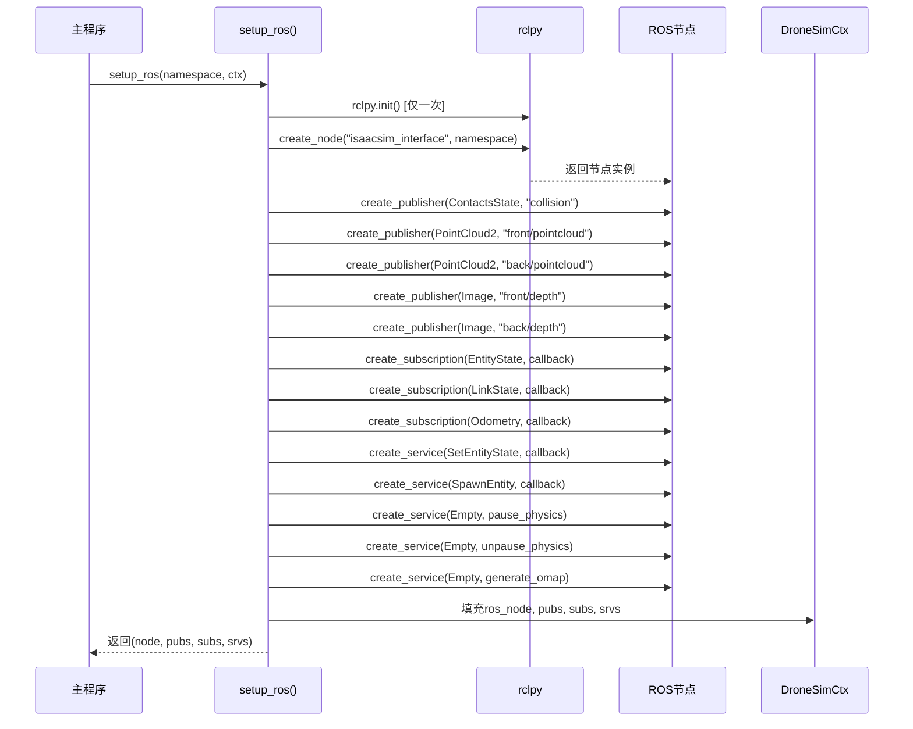
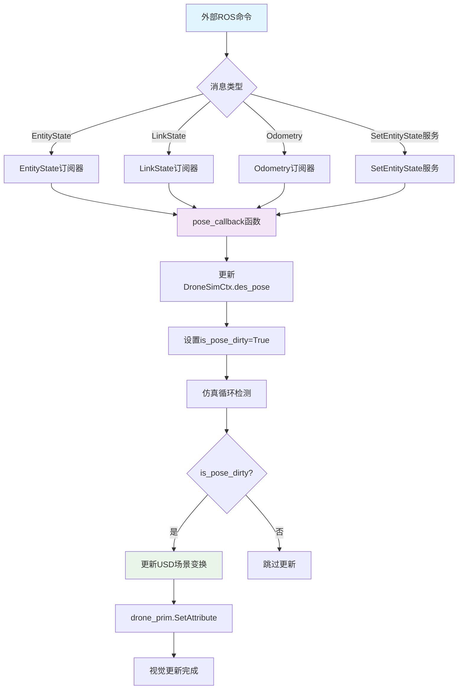
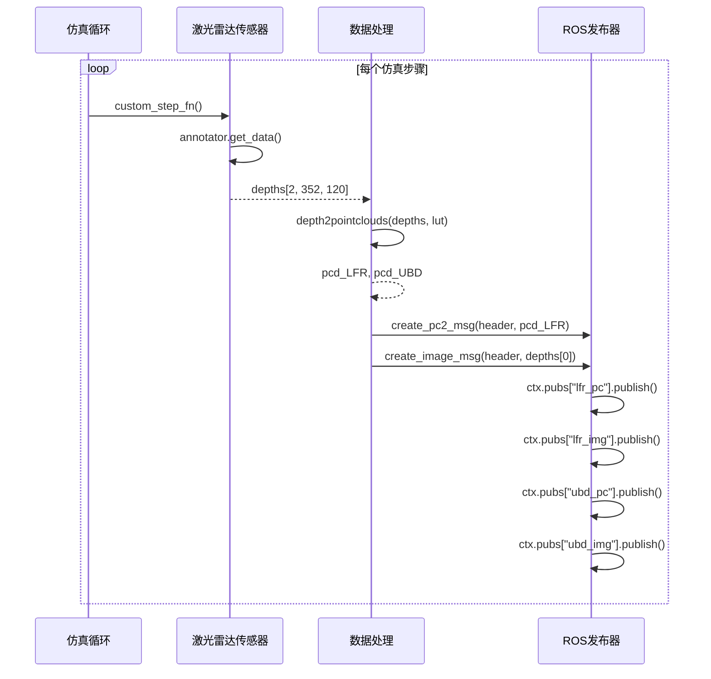
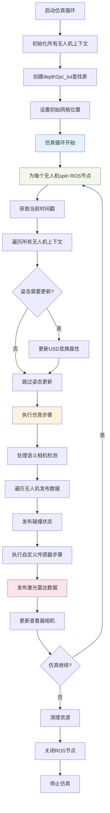

# IsaacSim ROS通信机制深度分析

## 概述

本文档详细分析了IsaacSim Python脚本中ROS2通信机制的实现，包括多无人机系统的消息传递、服务调用和数据发布流程。

## 系统架构

### 核心组件关系

```mermaid
classDiagram
    class SimulationApp {
        +CONFIG: dict
        +initialize()
        +update()
        +close()
    }
    
    class DroneSimCtx {
        +namespace: str
        +prim_path: str
        +ros_node: Node
        +pubs: dict
        +subs: dict
        +srvs: dict
        +drone_prim: object
        +des_pose: DronePose
        +is_pose_dirty: bool
        +custom_step_fn: callable
        +depth2pc_lut: ndarray
    }
    
    class DronePose {
        +pos: Gf.Vec3d
        +quat: Gf.Quatf
    }
    
    class ROSNode {
        +namespace: str
        +create_publisher()
        +create_subscription()
        +create_service()
        +get_logger()
        +get_clock()
    }
    
    class ROSPublishers {
        +collision: Publisher~ContactsState~
        +lfr_pc: Publisher~PointCloud2~
        +ubd_pc: Publisher~PointCloud2~
        +lfr_img: Publisher~Image~
        +ubd_img: Publisher~Image~
    }
    
    class ROSSubscribers {
        +gazebo_entitystate: Subscription~EntityState~
        +gazebo_linkstate: Subscription~LinkState~
        +odometry: Subscription~Odometry~
    }
    
    class ROSServices {
        +set_entity_state: Service~SetEntityState~
        +spawn_entity: Service~SpawnEntity~
        +pause_physics: Service~Empty~
        +unpause_physics: Service~Empty~
        +generate_omap: Service~Empty~
    }
    
    SimulationApp ||--o{ DroneSimCtx : manages
    DroneSimCtx ||--|| ROSNode : contains
    DroneSimCtx ||--|| DronePose : has
    ROSNode ||--|| ROSPublishers : creates
    ROSNode ||--|| ROSSubscribers : creates  
    ROSNode ||--|| ROSServices : creates
```

## ROS2通信机制实现

### 1. ROS2桥接扩展初始化

```python
# 启用Isaac Sim的ROS2桥接扩展
extensions.enable_extension("isaacsim.ros2.bridge")

# 导入ROS2相关模块
import rclpy
from rclpy.node import Node
from gazebo_msgs.msg import EntityState, ContactsState, ContactState
from gazebo_msgs.srv import SetEntityState, SpawnEntity
from sensor_msgs.msg import PointCloud2, PointField, Image
from std_msgs.msg import Header
from std_srvs.srv import Empty
```

### 2. 多无人机ROS节点创建流程



### 3. 运动控制消息处理机制

#### A. EntityState消息处理

```python
def create_drone_pose_callback(ctx: DroneSimCtx):
    def callback_drone_entitystate_msg(entitystate_msg):
        pos = entitystate_msg.pose.position
        quat = entitystate_msg.pose.orientation
        
        # 多种命名格式支持
        expected_names = [
            "quadrotor", 
            ctx.namespace, 
            f"{ctx.namespace}/quadrotor", 
            f"{ctx.namespace}_quadrotor"
        ]
        
        if entitystate_msg.name in expected_names:
            ctx.des_pose = DronePose(
                pos=Gf.Vec3d(pos.x, pos.y, pos.z),
                quat=Gf.Quatf(quat.w, quat.x, quat.y, quat.z)
            )
            ctx.is_pose_dirty = True
    
    return callback_drone_entitystate_msg
```

#### B. 运动控制数据流



### 4. 传感器数据发布流程

#### A. 激光雷达数据处理



#### B. 碰撞检测发布

```python
# 碰撞检测和发布
header = Header()
header.stamp = t_now.to_msg()
header.frame_id = "world"
msg = ContactsState(header=header)

if check_drone_collision(curr_stage, ctx.prim_path):
    msg.states.append(ContactState(collision1_name=f"drone_{ctx.namespace}"))
    
ctx.pubs["collision"].publish(msg)
```

### 5. 多无人机仿真主循环



## 关键技术特性

### 1. 命名空间隔离机制

```python
# ROS话题命名空间化
/{namespace}/front/pointcloud
/{namespace}/back/pointcloud  
/{namespace}/front/depth
/{namespace}/back/depth
/{namespace}/collision

# ROS服务命名空间化
/{namespace}/set_entity_state
/{namespace}/spawn_entity
/{namespace}/pause_physics
/{namespace}/unpause_physics
/{namespace}/generate_omap
```

### 2. 线程安全设计

- 每个无人机有独立的ROS节点实例
- 使用`rclpy.spin_once()`非阻塞处理消息
- 姿态更新使用`is_pose_dirty`标志避免竞争

### 3. 消息类型映射

| Isaac Sim数据 | ROS2消息类型 | 用途 |
|---------------|-------------|------|
| 激光雷达点云 | `sensor_msgs/PointCloud2` | 3D环境感知 |
| 深度图像 | `sensor_msgs/Image` | 2D深度信息 |
| 碰撞状态 | `gazebo_msgs/ContactsState` | 安全监控 |
| 实体状态 | `gazebo_msgs/EntityState` | 位置控制 |
| 链接状态 | `gazebo_msgs/LinkState` | 关节控制 |
| 里程计 | `nav_msgs/Odometry` | 导航信息 |

### 4. 性能优化策略

- **查找表缓存**: `depth2pc_lut`预计算深度到点云转换
- **批量处理**: 同时处理多个无人机的数据
- **条件发布**: 只在数据变化时发布消息
- **非阻塞通信**: 使用`timeout_sec=0.01`避免阻塞

## 扩展性设计

### 1. 自定义传感器集成

```python
# 在DroneSimCtx中添加自定义步骤函数
ctx.custom_step_fn = lidar_step_wrapper

# 在仿真循环中调用
if ctx.custom_step_fn is not None:
    sensor_data = ctx.custom_step_fn()
    # 处理和发布传感器数据
```

### 2. 新消息类型支持

```python
# 添加新的发布器
pubs["new_sensor"] = node.create_publisher(NewMsgType, "new_topic", 1)

# 添加新的订阅器  
subs["new_command"] = node.create_subscription(
    CmdMsgType, "new_command", callback_function, 1
)
```

## 总结

IsaacSim的ROS通信机制通过以下关键设计实现了高效的多无人机仿真：

1. **模块化架构**: 每个无人机都有独立的ROS上下文
2. **标准化接口**: 使用标准ROS2消息类型确保兼容性
3. **实时性能**: 非阻塞消息处理和优化的数据流
4. **可扩展性**: 支持自定义传感器和消息类型
5. **命名空间隔离**: 避免多无人机间的话题冲突

这种设计使得IsaacSim能够无缝集成到现有的ROS2生态系统中，为复杂的多机器人仿真提供了强大的基础。