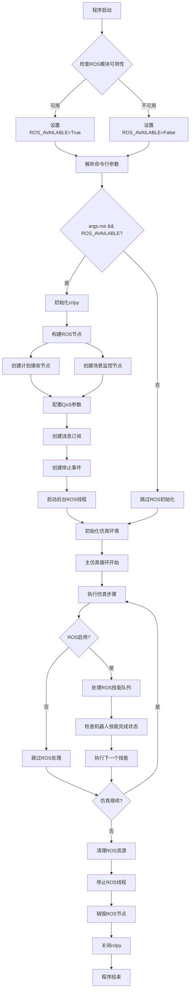
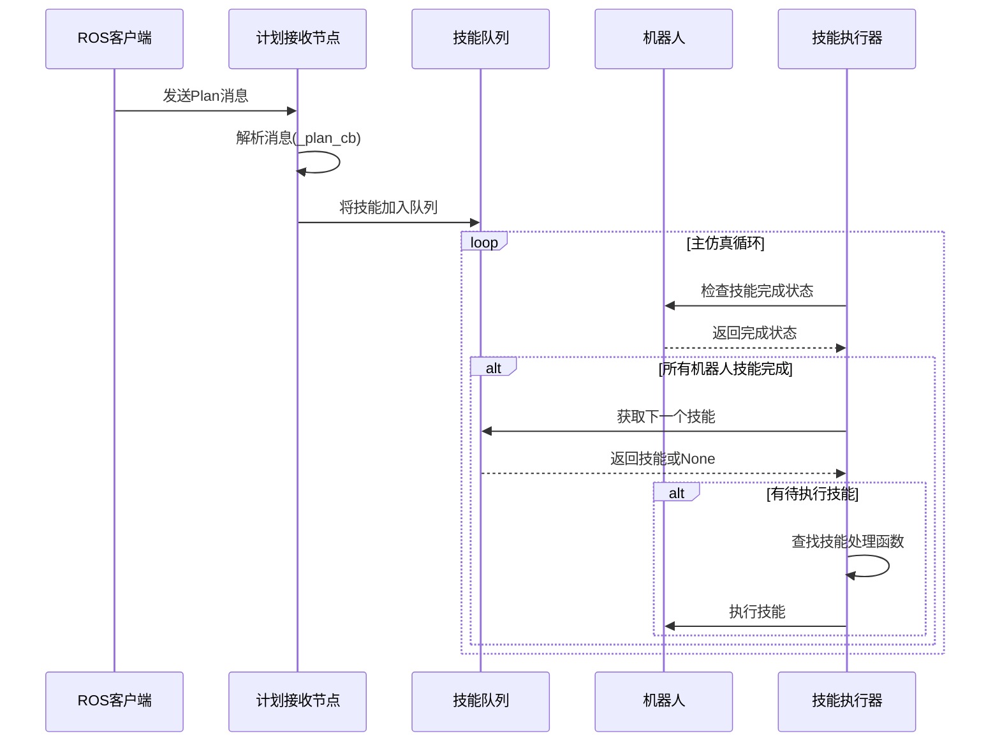

# Isaac Sim中ROS创建和初始化流程分析

## 概述

本文档分析了Isaac Sim仿真环境中ROS 2系统的创建、初始化和运行流程。该系统采用了模块化设计，支持条件初始化和异步运行。

## 核心组件

### 1. ROS可用性检查模块
- **功能**: 检测ROS 2模块是否可用
- **实现**: 通过try-except导入机制
- **全局标志**: `ROS_AVAILABLE`

### 2. ROS节点构建器
- **计划接收节点**: `BaseNode("plan_receiver")`
- **场景监控节点**: `SceneMonitorNode()`
- **QoS配置**: 可靠性传输，保持最新50条消息

### 3. 后台执行器
- **多线程执行器**: `MultiThreadedExecutor(num_threads=4)`
- **异步运行**: 独立线程，不阻塞主仿真循环
- **优雅关闭**: 支持事件驱动的停止机制

## 详细流程分析

### 初始化阶段

```python
# 1. 模块导入和可用性检查
try:
    import rclpy
    from rclpy.executors import MultiThreadedExecutor
    # ... 其他ROS导入
    ROS_AVAILABLE = True
except ImportError:
    ROS_AVAILABLE = False

# 2. 命令行参数解析
parser.add_argument("--ros", type=bool, default=True)
args = parser.parse_args()
```

### 节点创建和配置

```python
def build_ros_nodes() -> tuple:
    # QoS配置
    qos = QoSProfile(
        reliability=ReliabilityPolicy.RELIABLE,
        history=HistoryPolicy.KEEP_LAST,
        depth=50,
    )
    
    # 创建节点
    plan_receiver = BaseNode("plan_receiver")
    plan_receiver.create_subscription(PlanMsg, "/Plan", _plan_cb, qos)
    scene_monitor = SceneMonitorNode()
    
    return plan_receiver, scene_monitor
```

### 技能处理机制

```python
# 全局技能队列
_skill_queues = defaultdict(deque)
_skill_lock = threading.Lock()

# 技能执行表
_SKILL_TABLE = {
    "navigate-to": _skill_navigate_to,
    "pick-up": _skill_pick_up,
    "put-down": _skill_put_down,
}
```

## 流程图



## 技能处理流程



## 关键特性

### 1. 条件初始化
- 只有在ROS可用且用户启用时才初始化ROS系统
- 优雅降级：ROS不可用时仍可正常运行仿真

### 2. 异步架构
- ROS在独立线程中运行，使用`MultiThreadedExecutor`
- 主仿真循环不被ROS阻塞
- 通过`threading.Event`实现优雅关闭

### 3. 技能队列系统
- 使用`defaultdict(deque)`管理每个机器人的技能队列
- 线程安全的技能添加和执行
- 支持多种技能类型：导航、抓取、放置

### 4. 依赖注入
- 使用`@inject`装饰器注入依赖
- 通过容器管理组件生命周期
- 支持模块化的技能扩展

## 配置参数

### QoS配置
```python
qos = QoSProfile(
    reliability=ReliabilityPolicy.RELIABLE,  # 可靠传输
    history=HistoryPolicy.KEEP_LAST,         # 保持最新消息
    depth=50,                                # 队列深度
)
```

### 执行器配置
```python
exec_ = MultiThreadedExecutor(num_threads=4)  # 4线程执行器
```

## 错误处理

1. **模块导入失败**: 设置`ROS_AVAILABLE=False`，继续运行
2. **ROS初始化失败**: 记录错误，禁用ROS功能
3. **技能执行失败**: 记录错误，继续处理下一个技能
4. **节点销毁失败**: 忽略错误，确保程序正常退出

## 总结

Isaac Sim的ROS集成采用了健壮的设计模式：

- **模块化**: 清晰分离ROS功能和仿真核心
- **容错性**: 支持ROS不可用时的优雅降级
- **异步性**: ROS和仿真并行运行，互不阻塞
- **扩展性**: 通过技能表和依赖注入支持功能扩展
- **可维护性**: 清晰的生命周期管理和资源清理

这种架构确保了Isaac Sim能够与ROS 2系统无缝集成，同时保持系统的稳定性和可扩展性。