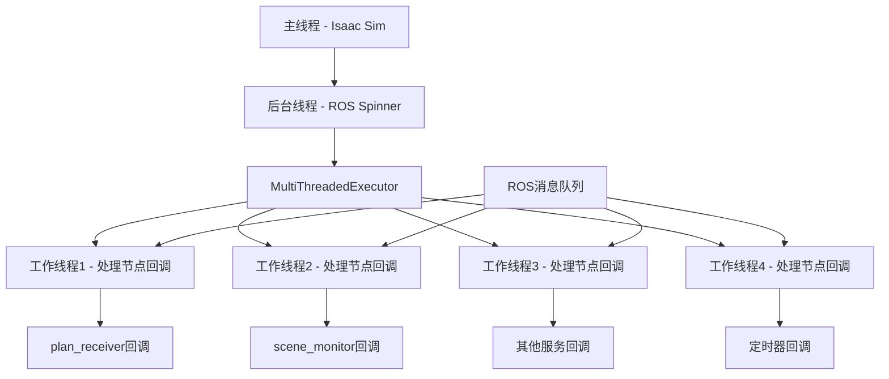
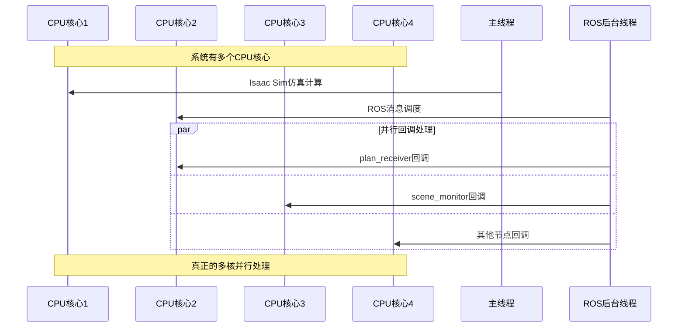

# ROS多线程实现机制分析

## 当前多线程架构

### 1. 线程层级结构

```python
# 主线程：Isaac Sim仿真
def main():
    # Isaac Sim主循环运行在主线程
    while simulation_app.is_running():
        env.step(action=None)  # 仿真计算
        process_ros_skills(env, swarm_manager)  # 技能处理

# 后台线程：ROS消息处理
def spin_ros_in_background(nodes, stop_evt):
    exec_ = MultiThreadedExecutor(num_threads=4)  # 4个工作线程
    while not stop_evt.is_set():
        exec_.spin_once(timeout_sec=0.05)
```

### 2. MultiThreadedExecutor内部机制



## MultiThreadedExecutor工作原理

### 1. 线程池管理
```python
class MultiThreadedExecutor:
    def __init__(self, num_threads=4):
        self._threads = []
        self._executor = ThreadPoolExecutor(max_workers=num_threads)
        self._callback_queue = Queue()
    
    def spin_once(self, timeout_sec=None):
        # 1. 检查所有节点的消息队列
        for node in self._nodes:
            for subscription in node.subscriptions:
                if subscription.has_pending_messages():
                    # 2. 将回调提交到线程池
                    future = self._executor.submit(
                        subscription.callback, 
                        subscription.get_message()
                    )
```

### 2. 实际CPU利用情况



## 当前架构的CPU利用分析

### 1. 线程分布
```python
# 线程1：主线程 (CPU核心1)
- Isaac Sim渲染和物理计算
- 仿真步进
- 技能队列处理

# 线程2：ROS调度线程 (CPU核心2)  
- MultiThreadedExecutor.spin_once()
- 消息队列管理
- 线程池调度

# 线程3-6：ROS工作线程 (CPU核心3-6)
- 回调函数执行
- 消息处理
- 服务调用处理
```

### 2. 性能瓶颈分析

```python
# 当前可能的瓶颈
def _plan_cb(msg: PlanMsg):
    """计划回调 - 可能的CPU密集操作"""
    try:
        steps = sorted(msg.steps, key=lambda s: s.timestep)  # O(n log n)
        
        with _skill_lock:  # 锁竞争可能成为瓶颈
            for ts in steps:
                for rs in ts.robots:
                    rc, rid = _parse_robot_id(rs.robot_id)  # 字符串解析
                    q = _skill_queues[(rc, rid)]
                    
                    for sk in rs.skill_list:
                        q.append(sk)  # 队列操作
    except Exception as e:
        logger.error(f"[PlanCB] Error: {e}")
```

## 优化多线程CPU利用的策略

### 1. 增加ROS工作线程数量

```python
# 当前配置
exec_ = MultiThreadedExecutor(num_threads=4)

# 优化配置 - 根据CPU核心数动态调整
import os
cpu_count = os.cpu_count()
optimal_threads = min(cpu_count - 2, 8)  # 保留2个核心给主线程
exec_ = MultiThreadedExecutor(num_threads=optimal_threads)
```

### 2. 分离不同类型的ROS节点

```python
def build_optimized_ros_nodes():
    """构建优化的ROS节点架构"""
    
    # 高频节点执行器 - 更多线程
    high_freq_executor = MultiThreadedExecutor(num_threads=6)
    plan_receiver = BaseNode("plan_receiver")
    high_freq_executor.add_node(plan_receiver)
    
    # 低频节点执行器 - 较少线程  
    low_freq_executor = MultiThreadedExecutor(num_threads=2)
    scene_monitor = SceneMonitorNode()
    low_freq_executor.add_node(scene_monitor)
    
    return (high_freq_executor, low_freq_executor)

def spin_multiple_executors(executors, stop_evt):
    """运行多个执行器"""
    threads = []
    
    for i, executor in enumerate(executors):
        thread = threading.Thread(
            target=lambda ex=executor: spin_single_executor(ex, stop_evt),
            name=f"ROS-Executor-{i}"
        )
        thread.start()
        threads.append(thread)
    
    return threads
```

### 3. 异步技能处理优化

```python
import asyncio
from concurrent.futures import ThreadPoolExecutor

class AsyncSkillProcessor:
    def __init__(self, max_workers=4):
        self.executor = ThreadPoolExecutor(max_workers=max_workers)
        self.loop = asyncio.new_event_loop()
    
    async def process_plan_async(self, msg: PlanMsg):
        """异步处理计划消息"""
        # 将CPU密集型操作分发到线程池
        tasks = []
        
        for ts in msg.steps:
            task = self.loop.run_in_executor(
                self.executor,
                self._process_timestep,
                ts
            )
            tasks.append(task)
        
        # 并行处理所有时间步
        await asyncio.gather(*tasks)
    
    def _process_timestep(self, timestep):
        """在线程池中处理单个时间步"""
        for rs in timestep.robots:
            rc, rid = _parse_robot_id(rs.robot_id)
            with _skill_lock:
                q = _skill_queues[(rc, rid)]
                for sk in rs.skill_list:
                    q.append(sk)
```

### 4. 无锁数据结构优化

```python
from queue import Queue
import threading

class LockFreeSkillManager:
    """无锁技能管理器"""
    
    def __init__(self):
        # 使用线程安全的队列替代锁
        self.skill_queues = defaultdict(lambda: Queue())
        self.robot_status = {}
    
    def add_skills(self, robot_id: str, skills: list):
        """无锁添加技能"""
        rc, rid = _parse_robot_id(robot_id)
        queue = self.skill_queues[(rc, rid)]
        
        for skill in skills:
            queue.put(skill)  # Queue.put是线程安全的
    
    def get_next_skill(self, robot_id: str):
        """无锁获取下一个技能"""
        rc, rid = _parse_robot_id(robot_id)
        queue = self.skill_queues[(rc, rid)]
        
        try:
            return queue.get_nowait()  # 非阻塞获取
        except:
            return None
```

## CPU亲和性优化

### 1. 线程CPU绑定

```python
import psutil
import os

def set_thread_affinity():
    """设置线程CPU亲和性"""
    
    # 获取CPU核心数
    cpu_count = psutil.cpu_count(logical=False)  # 物理核心
    logical_count = psutil.cpu_count(logical=True)  # 逻辑核心
    
    # 主线程绑定到性能核心
    main_cores = [0, 1]  # 通常前几个是性能核心
    os.sched_setaffinity(0, main_cores)
    
    # ROS线程绑定到其他核心
    ros_cores = list(range(2, min(8, logical_count)))
    
    return ros_cores

def create_affinity_aware_threads():
    """创建具有CPU亲和性的线程"""
    ros_cores = set_thread_affinity()
    
    def ros_worker_with_affinity(core_id, executor, stop_evt):
        # 设置线程CPU亲和性
        os.sched_setaffinity(0, [core_id])
        
        # 运行ROS执行器
        while not stop_evt.is_set():
            executor.spin_once(timeout_sec=0.01)
    
    threads = []
    for i, core in enumerate(ros_cores):
        thread = threading.Thread(
            target=ros_worker_with_affinity,
            args=(core, executors[i % len(executors)], stop_evt)
        )
        threads.append(thread)
    
    return threads
```

## 性能监控和调优

### 1. 线程性能监控

```python
import time
import psutil
from collections import defaultdict

class ThreadPerformanceMonitor:
    def __init__(self):
        self.stats = defaultdict(list)
        self.start_time = time.time()
    
    def monitor_ros_performance(self):
        """监控ROS线程性能"""
        process = psutil.Process()
        
        # 获取线程信息
        threads = process.threads()
        cpu_percent = process.cpu_percent(interval=1)
        
        # 记录统计信息
        self.stats['cpu_usage'].append(cpu_percent)
        self.stats['thread_count'].append(len(threads))
        self.stats['memory_usage'].append(process.memory_info().rss / 1024 / 1024)
        
        return {
            'cpu_usage': cpu_percent,
            'thread_count': len(threads),
            'memory_mb': process.memory_info().rss / 1024 / 1024
        }

# 在主循环中使用
monitor = ThreadPerformanceMonitor()

while simulation_app.is_running():
    env.step(action=None)
    
    # 每100帧监控一次性能
    if count % 100 == 0:
        perf_stats = monitor.monitor_ros_performance()
        logger.info(f"Performance: {perf_stats}")
    
    count += 1
```

## 推荐的优化配置

```python
def create_optimized_ros_system():
    """创建优化的ROS系统"""
    
    # 1. 根据硬件配置线程数
    cpu_cores = os.cpu_count()
    ros_threads = min(cpu_cores - 2, 8)  # 保留核心给Isaac Sim
    
    # 2. 创建分层执行器
    high_priority_executor = MultiThreadedExecutor(num_threads=ros_threads // 2)
    low_priority_executor = MultiThreadedExecutor(num_threads=ros_threads // 2)
    
    # 3. 使用无锁数据结构
    skill_manager = LockFreeSkillManager()
    
    # 4. 启用性能监控
    monitor = ThreadPerformanceMonitor()
    
    # 5. 设置CPU亲和性
    set_thread_affinity()
    
    return {
        'executors': [high_priority_executor, low_priority_executor],
        'skill_manager': skill_manager,
        'monitor': monitor
    }
```

## 总结

当前的多线程实现**确实能够利用CPU的多核能力**：

### 优势：
- ✅ 真正的并行处理（MultiThreadedExecutor）
- ✅ 主仿真线程与ROS线程分离
- ✅ 多个ROS回调可以并行执行

### 可优化点：
- 🔧 增加线程数量匹配CPU核心数
- 🔧 使用无锁数据结构减少竞争
- 🔧 实现CPU亲和性绑定
- 🔧 分离高频和低频节点处理
- 🔧 添加性能监控和调优

通过这些优化，可以更充分地利用现代多核CPU的计算能力，提升整个系统的性能和响应速度。