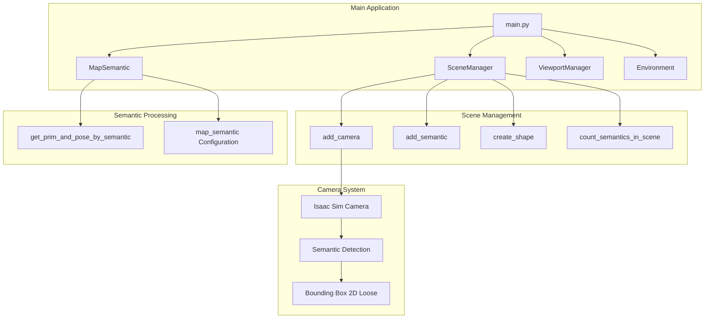
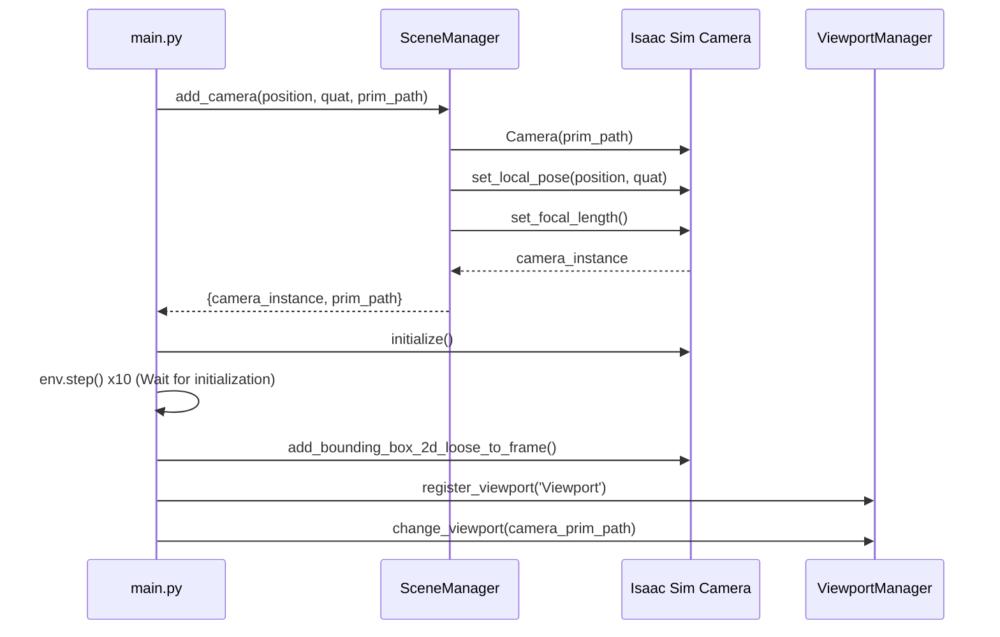
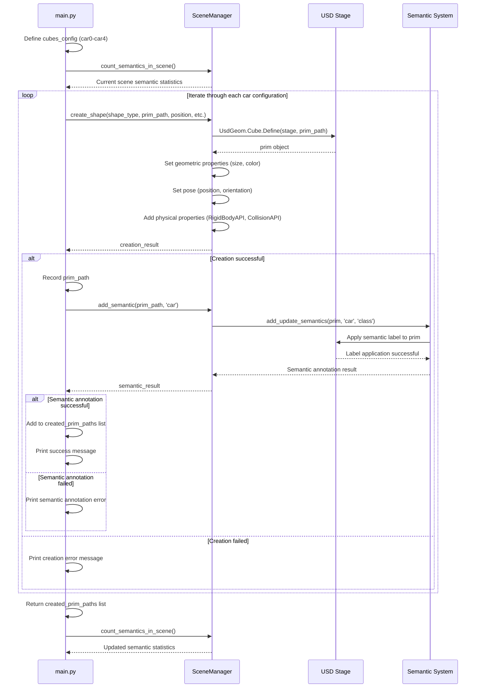
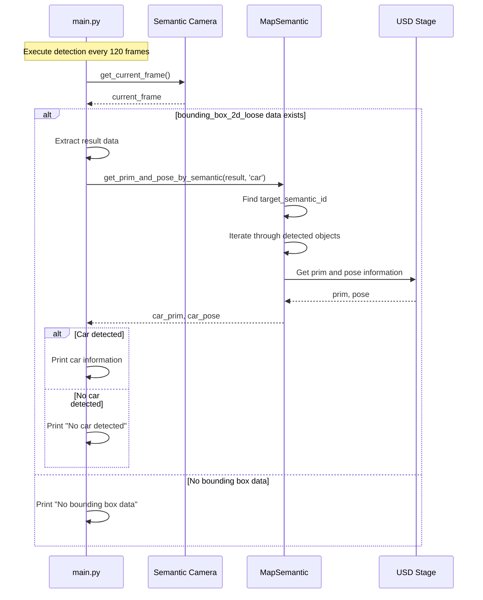
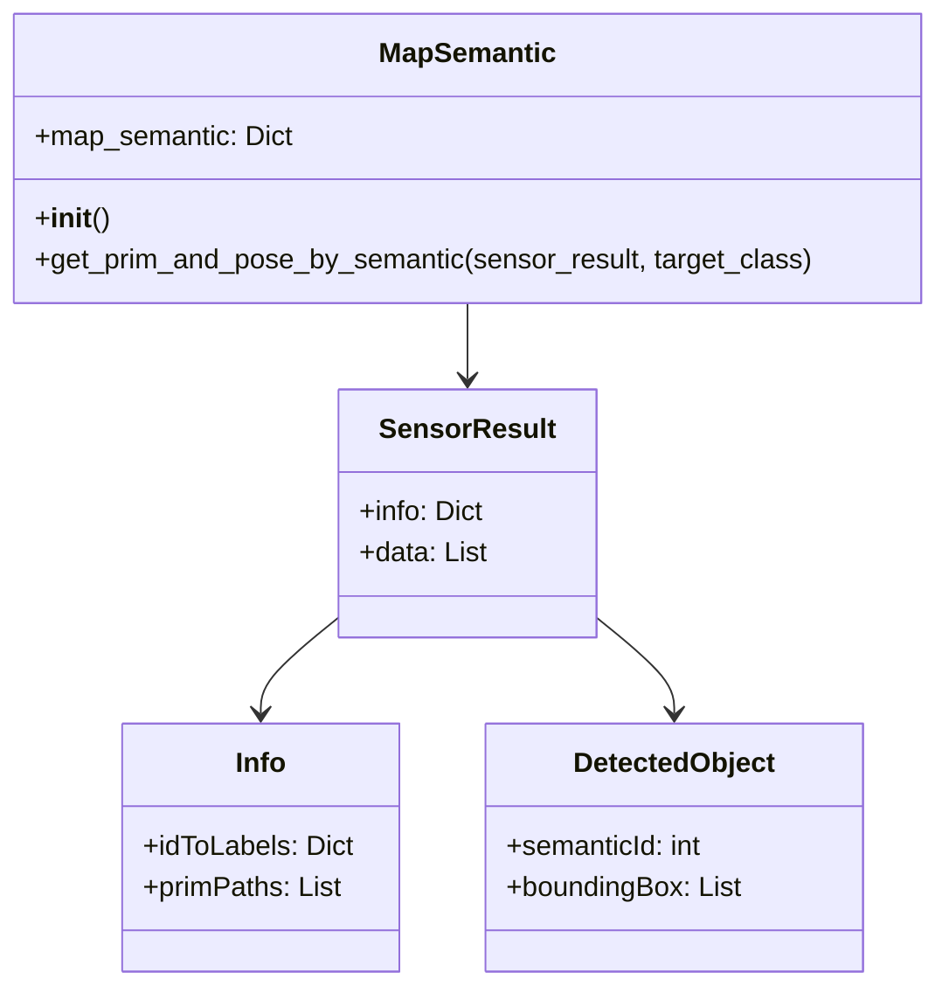
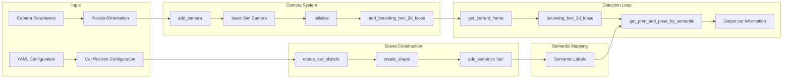

# Semantic Camera Program Logic Analysis

This document analyzes the semantic camera-related code logic in main.py, including the implementation of add camera in scene manager, semantic map, detect car functions, and add car semantic functionalities.

## System Architecture Overview



## Detailed Analysis of Core Components

### 1. Semantic Camera Creation Process



### 2. Car Objects Creation and Semantic Annotation



### 3. Semantic Detection Processing Flow



### 4. Semantic Map Data Structure



## Key Code Segment Analysis

### Scene Manager - add_camera Method

```python
def add_camera(self, position: List[float], quat: List[float], 
               focal_length: float = 2.0, prim_path: str = "/World/MyCam"):
    """
    Create semantic camera using Isaac Sim's high-level API
    
    Core steps:
    1. Create Camera instance
    2. Set position and orientation
    3. Set focal length
    4. Return camera_instance and prim_path
    """
    from isaacsim.sensors.camera import Camera
    
    camera_instance = Camera(prim_path=prim_path)
    camera_instance.set_local_pose(translation=position, orientation=quat, camera_axes='usd')
    camera_instance.set_focal_length(focal_length)
    
    return {
        "status": "success",
        "result": {
            "prim_path": prim_path,
            "camera_instance": camera_instance
        }
    }
```

### Semantic Map - Car Detection Function

```python
def get_prim_and_pose_by_semantic(self, sensor_result: Dict[str, Any], 
                                  target_semantic_class: str):
    """
    Parse sensor results to find objects with specific semantic labels
    
    Processing flow:
    1. Extract info and data from sensor_result
    2. Find ID corresponding to target_semantic_class in idToLabels
    3. Iterate through detection data, match semanticId
    4. Get corresponding prim and world coordinate pose
    """
    info = sensor_result['info']
    data = sensor_result['data']
    id_to_labels = info['idToLabels']
    prim_paths = info['primPaths']
    
    # Find semantic ID
    target_semantic_id = None
    for semantic_id, label_data in id_to_labels.items():
        if label_data.get('class') == target_semantic_class:
            target_semantic_id = int(semantic_id)
            break
    
    # Find matching detected objects
    for i, detected_object in enumerate(data):
        if detected_object['semanticId'] == target_semantic_id:
            prim_path = prim_paths[i]
            xform_prim = XFormPrim(prim_path)
            position, orientation = xform_prim.get_world_poses()
            usd_prim = xform_prim.prims[0]
            
            pose = {
                "position": position.tolist(),
                "orientation": orientation.tolist()
            }
            return usd_prim, pose
    
    return None, None
```

### Semantic Detection in Main Loop

```python
def process_semantic_detection(semantic_camera, map_semantic: MapSemantic):
    """
    Process semantic detection and car pose extraction
    
    Execution frequency: Once every 120 frames
    """
    try:
        current_frame = semantic_camera.get_current_frame()
        if current_frame and 'bounding_box_2d_loose' in current_frame:
            result = current_frame['bounding_box_2d_loose']
            if result:
                car_prim, car_pose = map_semantic.get_prim_and_pose_by_semantic(result, 'car')
                if car_prim is not None and car_pose is not None:
                    print("Detected car prim and pose:", car_prim, car_pose)
                else:
                    print("No car detected in current frame")
            else:
                print("No bounding box data available")
        else:
            print("No frame data or bounding box key available")
    except Exception as e:
        print(f"Error getting semantic camera data: {e}")
```

## Data Flow Diagram



## Key Technical Points

### 1. Camera Coordinate System Transformation
- Use `euler_to_quaternion` to convert Euler angles to quaternions
- Isaac Sim uses [w,x,y,z] quaternion format
- Camera axis system uses 'usd' standard

### 2. Semantic Annotation System
- Uses Isaac Sim's `add_update_semantics` API
- Supports class-type semantic labels
- Automatically manages semantic ID mapping

### 3. Bounding Box Detection
- `add_bounding_box_2d_loose_to_frame()` enables 2D loose bounding box detection
- Detection results contain semanticId, primPaths and other information
- Supports real-time object detection and localization

### 4. Dependency Injection Architecture
- Uses dependency_injector to manage component dependencies
- Injects services like MapSemantic through @inject decorator
- Supports modular and testable code structure

## Performance Optimization

1. **Detection Frequency Control**: Execute semantic detection once every 120 frames to avoid excessive computation
2. **Initialization Wait**: Wait 10 frames after camera initialization before enabling bounding box detection
3. **Exception Handling**: Comprehensive error handling mechanisms to ensure system stability
4. **Memory Management**: Proper object lifecycle management

This system implements complete semantic perception functionality, from scene construction and camera setup to real-time detection, providing powerful visual perception capabilities for robot navigation and task execution.